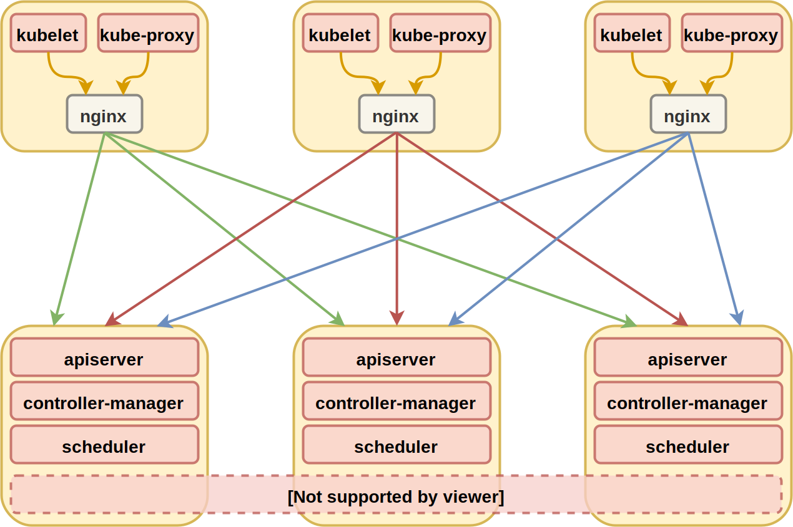

# kubernetes-ha-ansible

- **kubernetes:** v1.14.x、v.15.x
- **etcd:** v3.3.10
- **容器运行时:** docker 18.06.x、18.09.x; containerd
- **系统:** Ubuntu 16.04+、CentOS 7.4+

部署：ansible快速一键部署二进制kubernetes集群，所有二进制组件下载地址都是国内网络达，真正快速一键部署 。 

高可用：采用在每个worker节点部署代理的方式，完全兼容各种有网络限制（不能使用VIP）的云环境（例如阿里云）。  



# 说明文档


- 部署说明  
  
  1、[前期准备](docs/deploy/1、前期准备.md)  
  2、[配置节点IP和变量](docs/deploy/2、配置节点IP和变量.md)   
  3、[快速部署](docs/deploy/3、快速部署.md)   
  4、[分步部署](docs/deploy/4、分步部署.md)  
  5、[离线部署](docs/deploy/5、离线部署.md)  
  6、[重置集群](docs/deploy/6、重置集群.md)  
  
- roles说明  
  
  //TODO

  1、下载二进制文件  
  2、部署容器运行时  
  3、部署etcd集群  
  ​ ​ ​ ​ ​ ​ 3.1、生成etcd证书  
  ​ ​ ​ ​ ​ ​ 3.2、部署etcd集群  
  4、部署kubernetes集群  
  ​ ​ ​ ​ ​ ​ 4.1、生成kubernetes集群证书  
  ​ ​ ​ ​ ​ ​ 4.2、部署master节点  
  ​ ​ ​ ​ ​ ​ 4.3、节点配置  
  ​ ​ ​ ​ ​ ​ 4.4、部署node节点  
  5、部署扩展插件  


# 目录结构

```
.  
├── deploy.yml······················ 集群部署剧本
├── reset.yml······················· 集群重置剧本
├── inventory······················· 配置目录(hosts、变量)
├── kube-cluster···················· 部署的时候自动生成，存放下载的二进制文件、生成的证书和配置
└── roles
    ├── download···················· 1、下载二进制文件(国内网络可达)
    ├── cri························· 2、部署容器运行时(只安装一个)    
    │   ├── docker
    │   ├── containerd
    │   └── cri-o(TODO)
    ├── etcd························ 3、部署etcd集群  
    │   ├── pki(生成etcd证书)
    │   └── etcd(部署etcd集群)
    ├── k8s························· 4、部署kubernetes集群 
    │   ├── pki(生成kubernetes集群证书)
    │   ├── master(部署master节点)
    │   ├── sys-setup(配置节点)
    │   └── node(部署node节点)
    └── addons······················ 5、部署扩展插件(按需选择)    
        ├── network
        │   ├── flannel
        │   └── calico(TODO)
        ├── croedns
        ├── metrics_server(TODO)
        └── ingress_controller(TODO) 
```


# 快速部署

- 复制一份配置文件
  根据自己的集群IP地址信息配置`inventory/k8s-cluster/hosts.ini`文件

  ```
  cp -r inventory/k8s-example inventory/k8s-cluster
  ```

- 测试节点的连通性

  ```
  ansible -i inventory/k8s-cluster/hosts.ini -m ping all
  ```

- 执行剧本，部署集群

  ```
  ansible-playbook -i inventory/k8s-cluster/hosts.ini deploy.yml
  ```

- 查看集群信息

  ```
  root@ubuntu:~ # kubectl get cs
  NAME                 STATUS    MESSAGE             ERROR
  controller-manager   Healthy   ok                  
  scheduler            Healthy   ok                  
  etcd-0               Healthy   {"health":"true"}   
  etcd-2               Healthy   {"health":"true"}   
  etcd-1               Healthy   {"health":"true"}   
  ```

  ```
  root@ubuntu:~ # kubectl get nodes -o wide
  NAME      STATUS   ROLES    AGE     VERSION   INTERNAL-IP     EXTERNAL-IP   OS-IMAGE                KERNEL-VERSION              CONTAINER-RUNTIME
  master1   Ready    master   4m40s   v1.15.0   172.16.16.112   <none>        Ubuntu 18.04.2 LTS      4.15.0-51-generic           docker://18.9.7
  master2   Ready    master   4m40s   v1.15.0   172.16.16.113   <none>        Ubuntu 18.04.2 LTS      4.15.0-51-generic           docker://18.9.7
  master3   Ready    master   4m40s   v1.15.0   172.16.16.114   <none>        Ubuntu 18.04.2 LTS      4.15.0-51-generic           docker://18.9.7
  worker1   Ready    node     4m20s   v1.15.0   172.16.16.115   <none>        Ubuntu 18.04.2 LTS      4.15.0-51-generic           docker://18.9.7
  worker2   Ready    node     4m19s   v1.15.0   172.16.16.116   <none>        Ubuntu 18.04.2 LTS      4.15.0-51-generic           docker://18.9.7
  worker3   Ready    node     4m18s   v1.15.0   172.16.16.117   <none>        Ubuntu 18.04.2 LTS      4.15.0-51-generic           docker://18.9.7
  worker4   Ready    node     3m44s   v1.15.0   172.16.16.118   <none>        Ubuntu 18.04.2 LTS      4.15.0-51-generic           docker://18.9.7
  worker5   Ready    node     4m19s   v1.15.0   172.16.20.12    <none>        CentOS Linux 7 (Core)   3.10.0-862.6.3.el7.x86_64   docker://18.9.7
  ```
